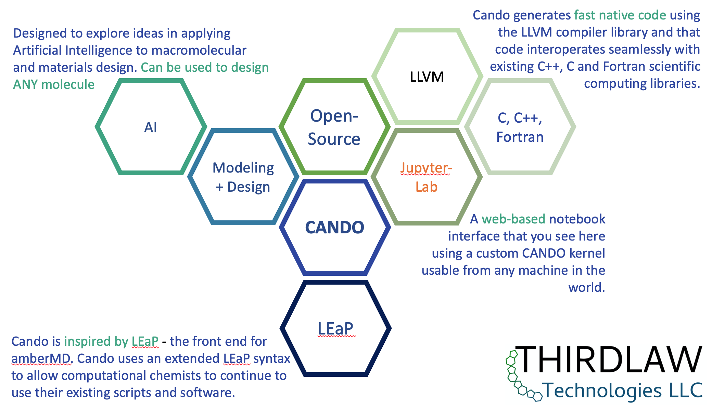

# CANDO
## Computer Aided Nanostructure Design and Optimization

Cando is an open-source, computational chemistry environment for
building and designing functional molecules and materials.

<div style="text-align: center"></div>

## Installation

### Install Cando using package managers:

1. apt-get for Ubuntu 22.04, Debian Bookworm (in testing) and Windows Subsystem for Linux (WSL2).
2. homebrew for MacOS.
3. pacman for Arch Linux.

These installations can be automatically updated from the Nighly Package Repository for each operating system to get bug fixes and the most up-to-date version of Cando. We are fixing (and creating :-)) bugs all the time.

If you want to use the jupyter-lab kernel implemented in Cando then follow the entire instructions below for each operating system.  If you only want to install Cando - then skip the steps that mention jupyter-lab.

Binary packages for Cando are built nightly starting about 2:00 AM EST and take about 4 hours to complete. Currently packages are built for Ubuntu 22.04, Debian Bookworm (in testing), Arch, and homebrew for macOS. The Ubuntu 22.04 package works on WSL2 (Windows Subsystem for Linux). To add the package repository to your local system and install Cando execute one of the following commands in a shell. You may need to prefix these commands with `sudo` for root access.

#### Installing from the Nightly Linux Package Repository for Ubuntu 22.04 or Debian Bookworm.

1. Install jupyter-lab using [miniconda](https://docs.conda.io/en/latest/miniconda.html).
  ```bash
  conda install -c conda-forge jupyterlab
  ```
  
2. Install Cando (this should detect and work for both Ubuntu or Debian)
  ```bash
  bash -c "$(curl -fsSL https://www.thirdlaw.tech/pkg/cando.sh)"
  ```
  
  If these scripts fail to detect your operating system then you can install manually via one of the following.

- Debian Bookworm
    ```bash
    curl -fsSL https://www.thirdlaw.tech/pkg/key.gpg | gpg --yes --dearmor --output /etc/apt/trusted.gpg.d/thirdlaw.gpg
    add-apt-repository "deb https://www.thirdlaw.tech/pkg/bookworm/ ./"
    apt-get update
    apt-get install cando
    ```
- Ubuntu 22.04 (Jammy)
    ```bash
    curl -fsSL https://www.thirdlaw.tech/pkg/key.gpg | gpg --yes --dearmor --output /etc/apt/trusted.gpg.d/thirdlaw.gpg
    add-apt-repository "deb https://www.thirdlaw.tech/pkg/jammy/ ./"
    apt-get update
    apt-get install cando
    ```
- Arch
    ```bash
    curl -fsSL https://www.thirdlaw.tech/pkg/key.gpg | pacman-key --add -
    pacman-key --lsign-key 009C1F20737D81230A0928CBC812E10EC39DF202
    echo -e "\n[thirdlaw]\nServer = https://www.thirdlaw.tech/pkg/arch\n" >>/etc/pacman.conf
    pacman -Sy --noconfirm cando-git
    ```

3. Enhance the jupyter-lab/Cando environment by installing jupyter-lab widgets, drawing and visualization tools.
  ```bash
  jupyter-labextension install cytoscape-clj kekule-clj ngl-clj resizable-box-clj @jupyter-widgets/jupyterlab-manager  jupyterlab_templates jupyterlab-debugger-restarts jupyterlab-molviewer
  ```
  
  If this fails with a message that you need node and npm, you can install them with miniconda and then try the jupyter-labextension install again.
  
  ```bash
  conda install -c conda-forge nodejs=17.9.0
  ```
 
#### Installing from the Nightly Homebrew Tap

Binary packages for MacOS Catalina, Big Sur and Monterey are available from the `clasp-developers/clasp` tap. 

Currently Cando only runs on x86-64 systems or Apple Silicon using rosetta2. The rosetta2 environment on Apple Silicon is excellent and quite performant. In the near future we will support native Apple Silicon - this is awaiting updates from Apple to the llvm JIT compiler.

To install Cando do the following:

1. Install homebrew for x86.

   [Set up an x86 shell](https://osxdaily.com/2020/11/18/how-run-homebrew-x86-terminal-apple-silicon-mac/) and open that shell.

   [Install homebrew](https://brew.sh/)
   
   Homebrew installed from an x86 shell installs in `/usr/local`.
   
2. Install jupyterlab

   ```bash
   brew install jupyterlab
   ```

3. Install Cando

    ```bash
    brew install clasp-developers/clasp/cando
    ```

These Homebrew formula can be built from source by adding the `--build-from-source` option and can be built directly the most recent commit by adding the `--HEAD` option.

After the initial install, to upgrade to the latest nightly build use `brew update && brew upgrade`. The `brew update` only needs to be done occasionally to update homebrew itself.

4. Enhance the jupyter-lab/Cando environment by installing jupyter-lab widgets, drawing and visualization tools.
  ```bash
  jupyter-labextension install cytoscape-clj kekule-clj ngl-clj resizable-box-clj @jupyter-widgets/jupyterlab-manager  jupyterlab_templates jupyterlab-debugger-restarts jupyterlab-molviewer
  ```

# Cando + Jupyter Demonstrations
Several JupyterLab notebooks that demonstrate how Cando can be used for computational chemistry can be found in [Cando-demos](https://github.com/cando-developers/cando-demos).

To run jupyter-lab and start a demo:

1. From your home directory run ```jupyter-lab```

2. copy and paste the provided link into a web browser (Firefox is recommended).

For WSL2 (Windows Subsystem for Linux) you may need to run ```jupyter-lab --no-browser```

# Video Tutorials
For up to date video demos and tutorials please [subscribe](https://www.youtube.com/channel/UC4xYBaHwB2kDCXaRALXdh7w) and like our videos on YouTube.

[Thermodynamic integration using a pre-built ligand library](https://www.youtube.com/watch?v=Md8rrrg7Kvg)

[Sketching molecules for thermodynamic integration calculations](https://www.youtube.com/watch?v=CSa2jzzwves)

[Running Cando calculation jobs inside a Docker image](https://www.youtube.com/watch?v=3bMJB8dV2WU)

